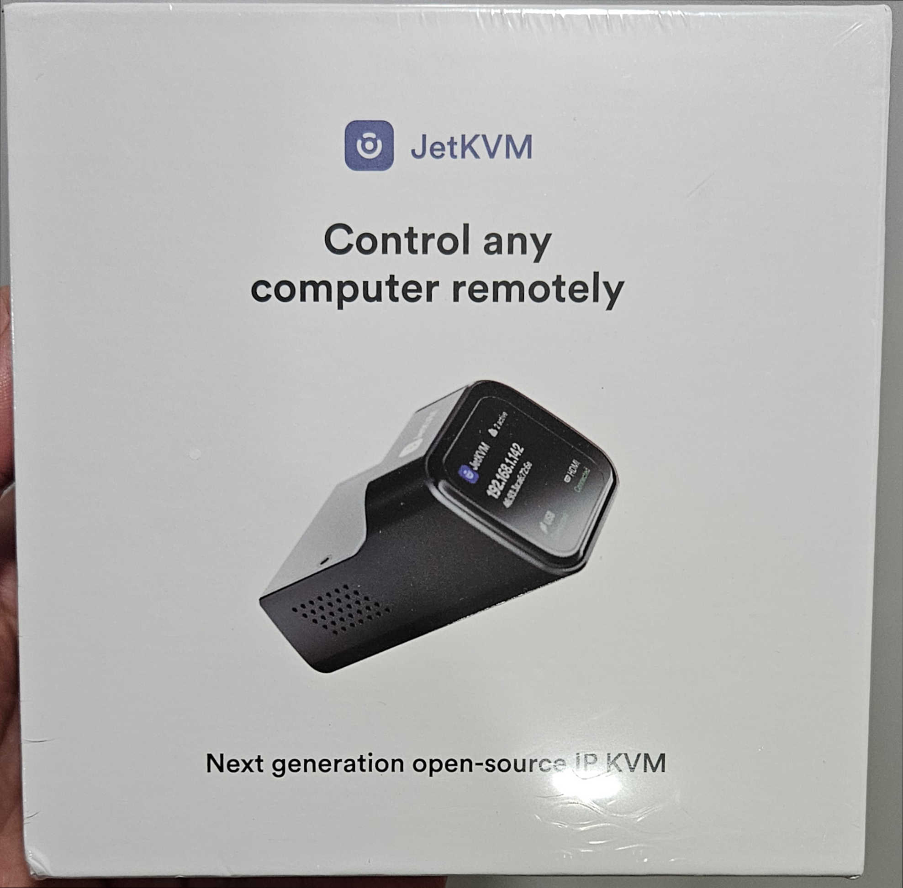
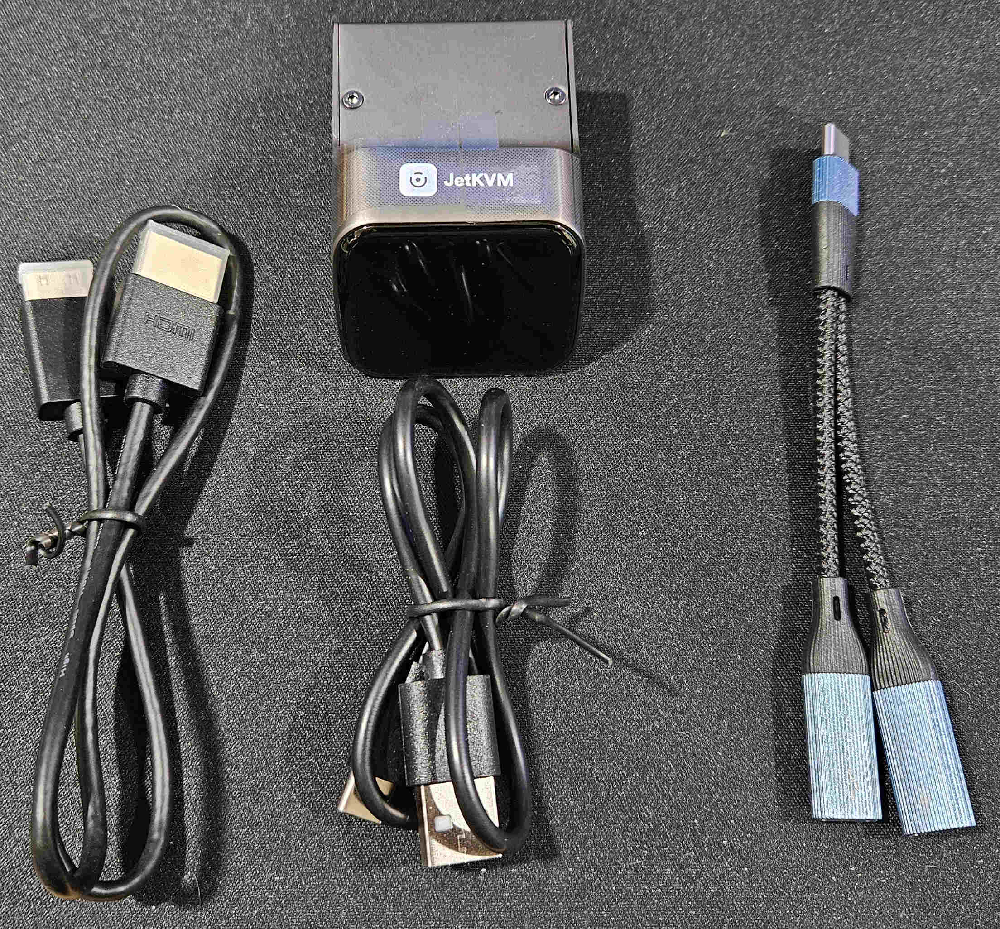
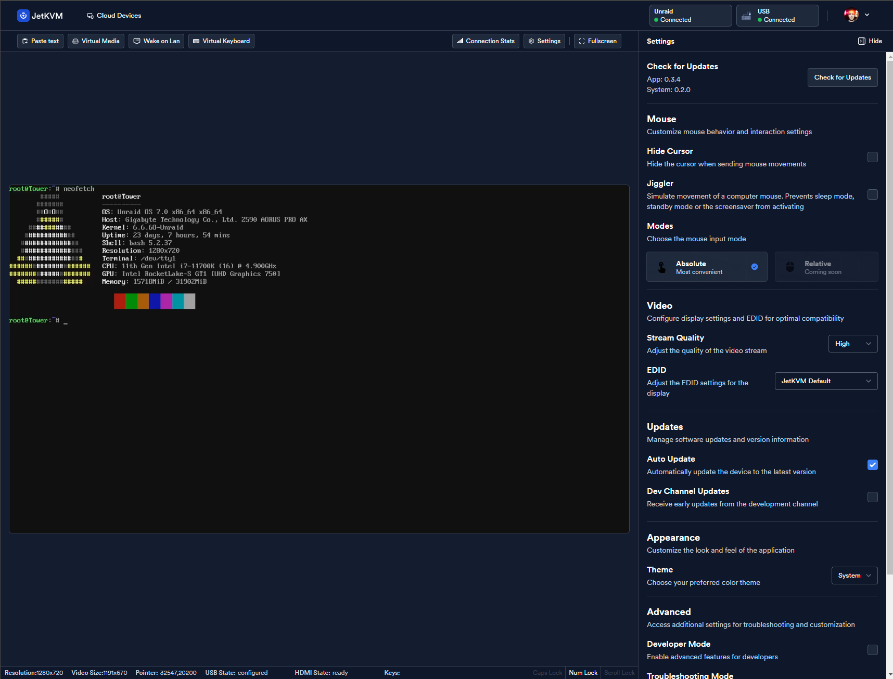

I am probably not the only one that has backed a crowd-funded project that never sees the light of day. Don't get me wrong; I have funded several successful campaigns like [Pebble](https://en.wikipedia.org/wiki/Pebble_\(watch\)), [Pebble Time](https://en.wikipedia.org/wiki/Pebble_\(watch\)#Pebble_Time), [MAD GOD](https://en.wikipedia.org/wiki/Mad_God), [System Shock](https://en.wikipedia.org/wiki/System_Shock_\(2023_video_game\)), [Hyper Light Drifter](https://en.wikipedia.org/wiki/Hyper_Light_Drifter), [Project Atma](https://en.wikipedia.org/wiki/I_Fight_Dragons?#Kickstarter_album_and_The_Near_Future_\(2013%E2%80%932014\)), and a few others, where I actually received what I backed, and so much more. Each of these campaigns had a story to them; though, not all were good... I funded [Mighty No. 9](https://en.wikipedia.org/wiki/Mighty_No._9), which was a laughable "spiritual successor" to Mega Man. I funded [Star Citizen](https://en.wikipedia.org/wiki/Star_Citizen), which I am confident will not be fully released before 2030. I funded the [OUYA](https://en.wikipedia.org/wiki/Ouya), which was... the OUYA... being both the most funded Kickstarter at the time, and perhaps the worst console of the modern era... Most recently, I funded [JetKVM](https://www.kickstarter.com/projects/jetkvm/jetkvm).

I run a server at home that provides a variety of services via Docker containers; game servers, media servers, security platforms... This website is even running on that server! But, as with anything tech-related, sometimes things just stop working. If I am sitting in my office I can just walk to the server and diagnose the problem. Maybe I just need to reboot it! That is so much harder when I am not at home... Recently, a bad boot drive was causing all sorts of issues. Suffice it to say that I certainly missed my five 9's with all of the reboots and crashes I experienced. As un-luck would have it, I would routinely be away from home when the server decided to kernel panic. If only there was a way to connect to the server...

The post title is the TL;DR, JetKVM is not a scam. It’s a nifty little device that lets you connect to a local or remote computer (or pretty much anything with an HDMI and USB port) and control the keyboard and mouse as though you’re sitting right there—no walking to the server required. You’ve probably heard of KVMs before—these are the unsung heroes of the enterprise IT world, letting you control multiple computers from one setup. Older models came with a jungle of cables. Newer ones are all fancy with browser-based access, but they’re also expensive. I was looking for something more affordable, but most of the DIY and open-source alternatives ([PiKVM](https://pikvm.org/buy/), [NanoKVM](https://www.aliexpress.us/item/3256807183501267.html?gatewayAdapt=glo2usa4itemAdapt), [TinyPilot Voyager 2a](https://tinypilotkvm.com/product/tinypilot-voyager2a)) these were either outside of my budget, or had some [security issues](https://www.hackster.io/news/security-researcher-warns-on-sipeed-s-nanokvm-finds-vulnerabilities-and-a-cat-in-the-firmware-e1157a9ff0f4) I wasn't comfortable with.

So, how was the whole backing experience? I backed the campaign in December 2024, and lo and behold, my JetKVM arrived in early February 2025. Communication from the creator was excellent. Frequent updates, videos, and Q&A the entire time. No complaints. I backed relatively late in the campaign, so many backers received their units prior to me; however, that at least legitimized the product. I never felt like it was vaporware or a scam. It felt nice.

Unboxing the device was simple. Included in the package was: the JetKVM unit, a mini-HDMI to HDMI cable, a USB-C to USB-A cable, and a USB-C splitter (Power/Data) which was included as a stretch goal.

Once plugged in, the device recognized my network and grabbed an IP address. Visiting that IP I was allowed to configure the device further, and enroll the device in the JetKVM cloud dashboard using my Google login. This allows for [remote access](https://jetkvm.com/docs/networking/remote-access). And... I was in.

The dashboard is simple and straight to the point. It allows for mounting files remotely, as if you were inserting a USB drive into the computer the JetKVM is connected to. And, with the optional (is it though?) [ATX power board extension](https://jetkvm.com/docs/peripheral-devices/alternative-power-sources#atx-board-extension), I could literally press the reset button on the computer, if the system is just cratered beyond saving.

I haven't mentioned the price. Maybe you looked at the links and found the Kickstarter, maybe not. This thing is $69 before extras and shipping. I paid $98; $69 for the device, $10 for the ATX expansion board, and $19 for shipping. Worth. It.

I am extremely pleased with JetKVM. It supplies some piece-of-mind that I can minimize downtime for my server. And, while it isn't a critical workload, I like to pretend that I still work in a datacenter. Uptime is king!

Lastly, but very important-ly; [The software is open-source](https://github.com/jetkvm/kvm). This might not matter to you, but I like seeing what is running under the hood!

I imagine that they will soon be available on Amazon or sold through some marketplace, once backer rewards are fulfilled. Snag one if you are so inclined!

