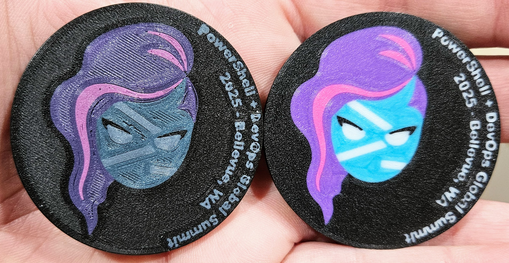

For the last several months I have been working on a few things for the 2025 PowerShell + DevOps Global Summit (which I will refer to as 'Summit'). I wrote this entry in advance, and scheduled the post to publish just as the doors to Summit are opening. If you are in Bellevue, WA for the conference, please, find me, give me a high-five, and tell me a joke or something! I love meeting people and talking shop! And (on this titled topic) make sure to pick up some swag!

<!--more-->

Summit 2024 was my second Summit. I was blown away in 2023, my first Summit, and was blown farther away upon returning the following year! How much farther can one be blown?! Is there no distance too great??? That remains to be seen!

During the 2023 Summit I was intrigued by the speaker swag that was given out. Individual speakers had stickers and pins... I had never seen anything like it. For the 2024 Summit I aimed to do a few things. Firstly, I wanted to speak. I submitted a paper or two. Secondly, I wanted to have some swag to give away. I was gonna be somebody!!! Well, here's the thing; Summit is a magnet for the best in the PowerShell community. And, most of the people in the community are better at PowerShell (or certainly more cutting edge) than I am. I could make excuses all day long, but I haven't stayed on the tippy-top of things like I'd like to. My talks were not accepted for the 2024 Summit. Though, I had already determined what I wanted to do for 'swag', regardless of if I was speaking or not. I wanted to make PowerShell logos and just give them away. Speakers would get a slightly larger logo, but everyone would at least get a small key-chain logo.

[Nearly a year ago I purchased a 3D printer.](/2025/01/31/3d-printing-tightly-compressed-spaghetti/) I bought it for this! I spent a considerable amount of money to make [this logo!](https://makerworld.com/en/models/439118-powershell-pwsh-logo#profileId-450118) I printed a bunch of them; several hundred!

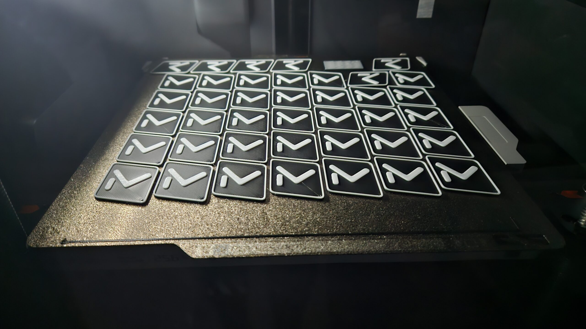

And, I just gave them away. I printed a big one for [Steven Judd](https://blog.stevenjudd.com/), and put it on a gold chain. Here is a super blurry photo!

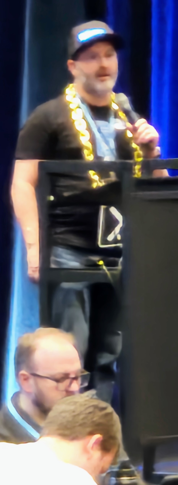

It was exhilarating!

So, for Summit 2025 I had to top it. I have been working on things for a long time... If you are there (here?) you already know. You likely scanned a QR code to get to my little blog. But for everyone else...

I attempted (and I did it!) a multi-color, light/dark mode 'challenge coin' of the PowerShell 7 (core?) mascot/hero. Two-sided, five colors on each layer... Check out the first attempt, and then the color corrected production samples!

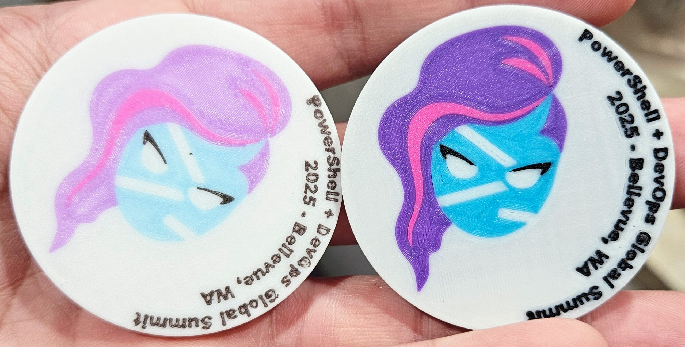

I know; bonkers-good, right?! Well, this is just for the public. I printed over 300 of these... ~150 of each color. That took... I won't lie, it took a really long time. Worth it? Yes, but my printer is pretty tired at this point... At least, that is what it would say if I didn't have more in plan for Summit 2025!

Speakers; what do they get? Sure, they get an audience, but what plastic novelty can I bestow upon them?! Well...

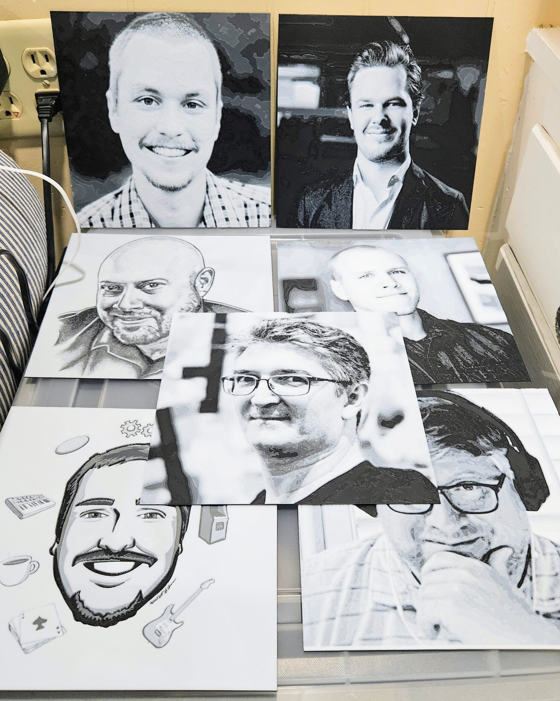
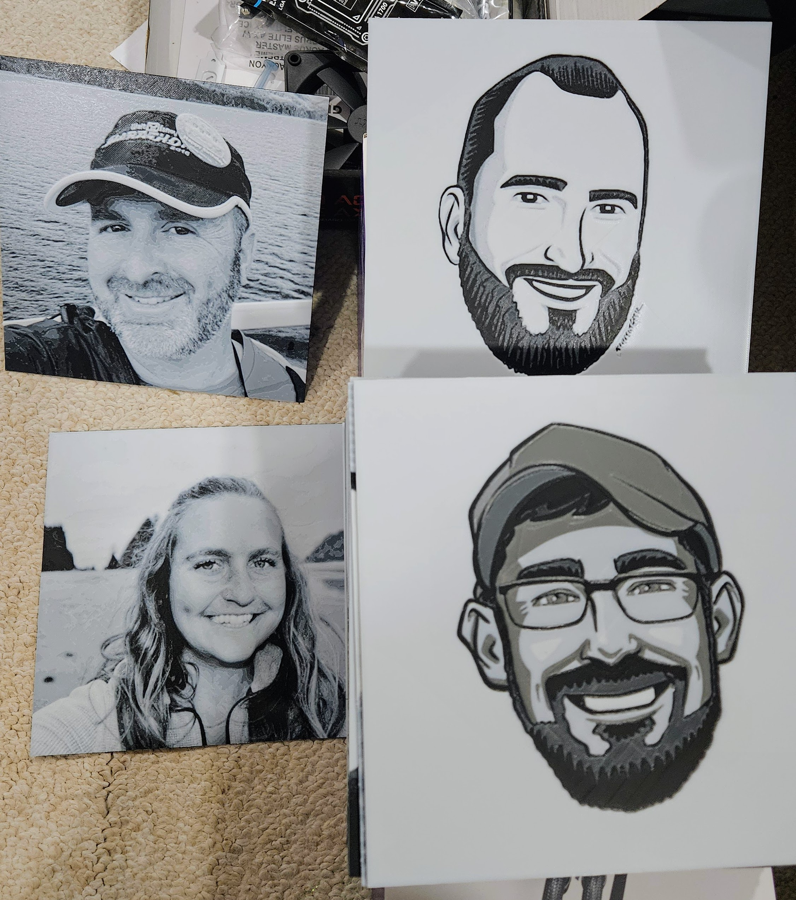
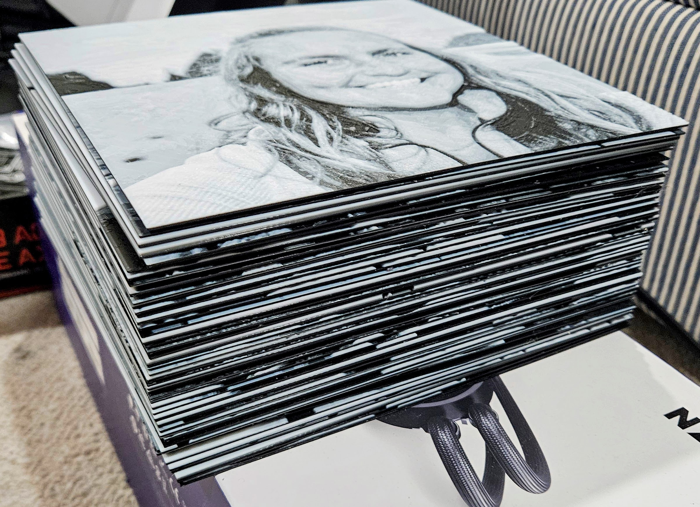

That's right... Every speaker is getting a profile pic! These took about 4-5 hours each! I am super happy with how they came out! If you are a speaker, at Summit 2025, right now, please, please, please!!! Take your profile picture home. I am so tired of looking at all of your monochromatic faces... And for a few of you out there; balance the levels in your next profile picture.

Okay, okay, okay... Enough playing around. It is now time to get serious. I know. I get it. How have I not been serious up to this point?! Well, there is more. See, I bought all the necessary filament (plastic) to print the coins. And, it turns out that I had a bunch left over. So... I modeled and printed several fairly large 'action figures?' of the PowerShell Hero!

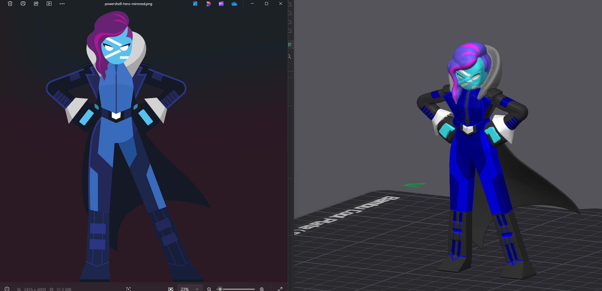
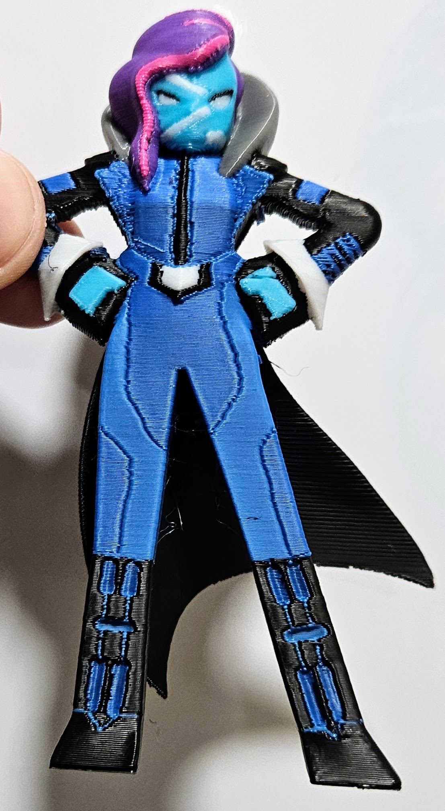
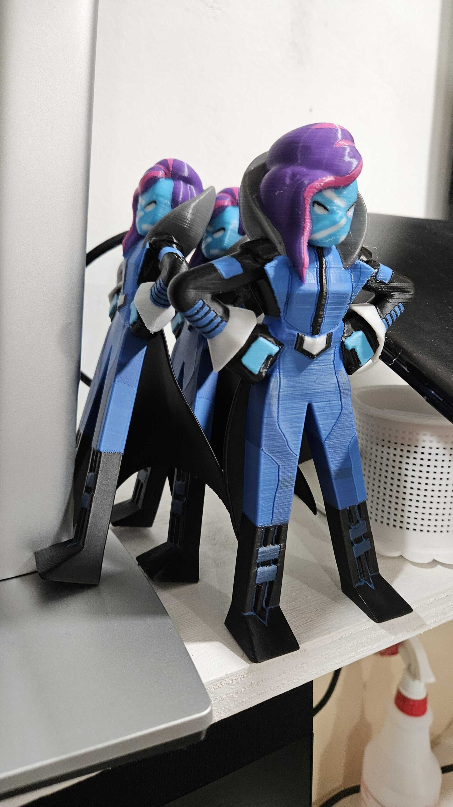
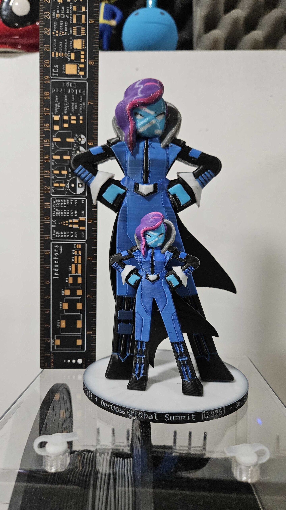

This was a trial... Like, just saying that doesn't do it justice. It was a significant endeavor. With all the color swaps and the size of the model, just to print one of these meant a three-day printing investment. If anything went wrong it likely spelled doom for the entire print. And, well, things went wrong for almost every print. In fact, even on the successful print, something still went wrong. I will likely post a separate entry about the problems I had.

So, there you have it! Feel free to reach out to me if you want to talk about printing, modeling, PowerShell, or anything else. More to come regarding Summit!

