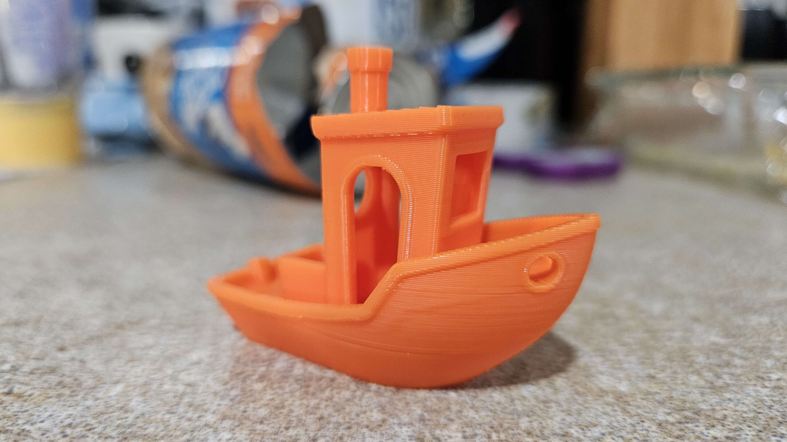

I purchased a P1S 3D printer from Bambu Labs nearly a year ago. It is my first 3D printer, and I am feeling a bit like a poser. My brother and several friends have had printers for years, and I distinctly remember stories about bed adhesion issues, poor quality prints, broken parts, and... Spaghetti! Honestly, as cool as the concept was, I was dissuaded from buying a printer because I didn't want another thing that required routine tinkering. I likened it to owning a car, but having to be a mechanic for it at the same time... I just wanted the 'thing' to do its job without constant maintenance or adjustments.

After almost a year with it, I can confidently say that the honeymoon phase is still going strong! The P1S is like an appliance in that it reliably continues to work. Every time I send a print job, I feel exhilaration and excitement. The quality of the prints I’ve produced is impressive; the layers are smooth, and the detail is astonishing. Each print feels like a mini achievement, and that sense of accomplishment only fuels my interest in 3D printing further.

Would I recommend this printer, or the P1P, the A1, or the X1C? Absolutely. They are great stable hardware, complemented by capable software that makes the whole process seamless. The user interface is intuitive, which significantly reduces the learning curve for newbies like me. More importantly, these printers have made the world of 3D printing accessible to individuals who may have been intimidated by the technology.

As I look into the future, I believe that printers going forward will have to meet or exceed this threshold of ease and capability, ideally at a lower price point. It's truly a great time to get into this hobby, as the innovations continue to bear fruit. While this is just a short post that has taken over a year to write (I started it in February 2024...), I hope to share more about my 3D printing journey, the challenges I’ve faced, and the cool things I am designing and printing. There's an entire universe of creativity waiting to be unlocked through this medium, and I’m excited to explore it and share my experiences along the way.

